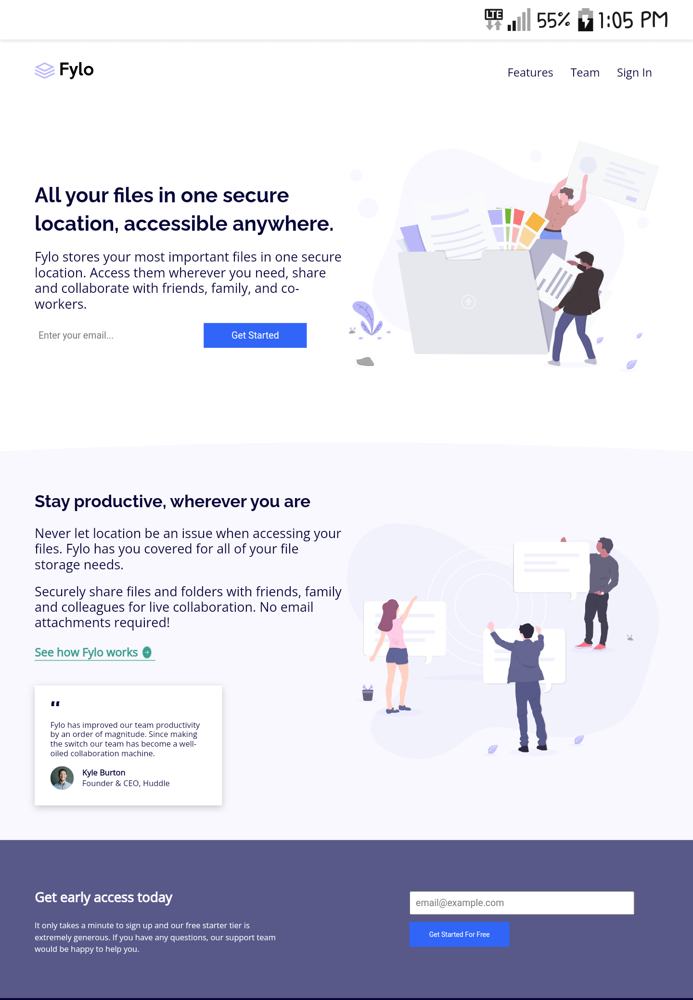
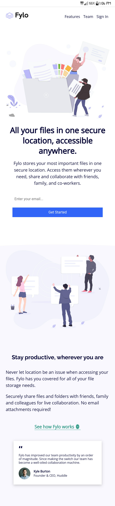

# Frontend Mentor - Fylo landing page with two column layout solution

This is a solution to the [Fylo landing page with two column layout challenge on Frontend Mentor](https://www.frontendmentor.io/challenges/fylo-landing-page-with-two-column-layout-5ca5ef041e82137ec91a50f5). Frontend Mentor challenges help you improve your coding skills by building realistic projects. 

## Table of contents

- [Overview](#overview)
  - [The challenge](#the-challenge)
  - [Screenshot](#screenshot)
  - [Links](#links)
- [My process](#my-process)
  - [Built with](#built-with)
  - [What I learned](#what-i-learned)
  - [Continued development](#continued-development)
  - [Useful resources](#useful-resources)
- [Author](#author)

## Overview

### The challenge

Users should be able to:

- View the optimal layout for the site depending on their device's screen size
- See hover states for all interactive elements on the page

### Screenshot

- ##### Desktop Layout

  - ##### Mobile layout 

### Links

- Live Site URL: [live Site](https://jacbfrancis.github.io/Fylo-landing-page-/)

## My process

### Built with

- Semantic HTML5 markup
- CSS custom properties
- Flexbox
- Desktop-first workflow
- Media Queries

### What I learned

I improved my knowledge on media quries and css flexbox.

### Continued development

- imorove my knowledge even further on css flexbox and Media queries.

- learn css Grid.

### Useful resources

- [Google fonts](https://fonts.google.com/) - This helped me to implement fonts on the website, so no trouble with font embedding.

- [Flat Icon](https://www.flaticon.com) - This helped with nice icons/images. I really liked this Website and plan to use it going forward.

## Author

- Website - [ Francis Jacob](https://github.com/Jacbfrancis)
- Twitter - [@jacobxavier_](https://twitter.com/jacobxavier_)

